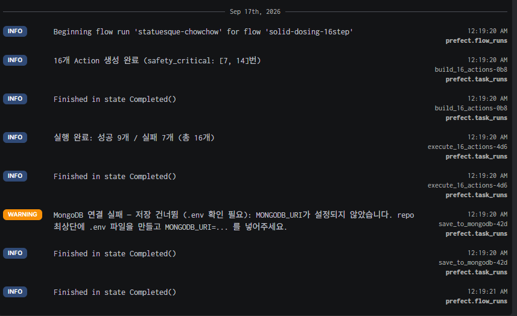
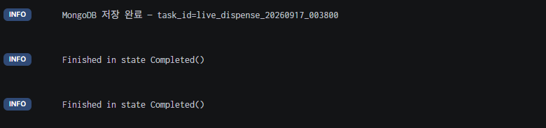
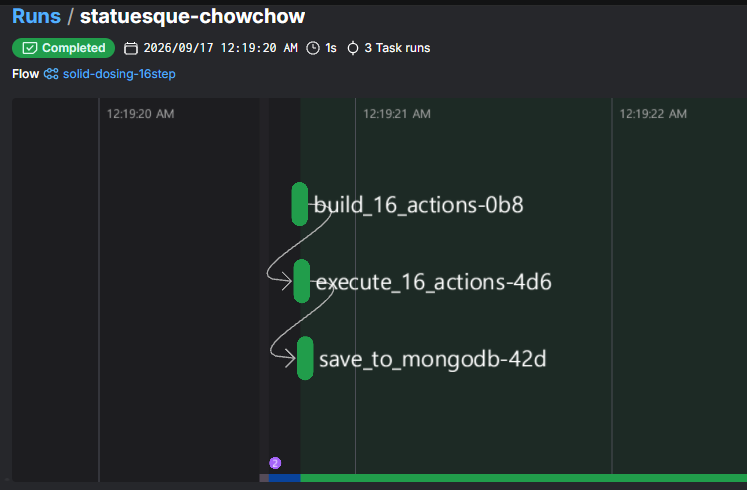
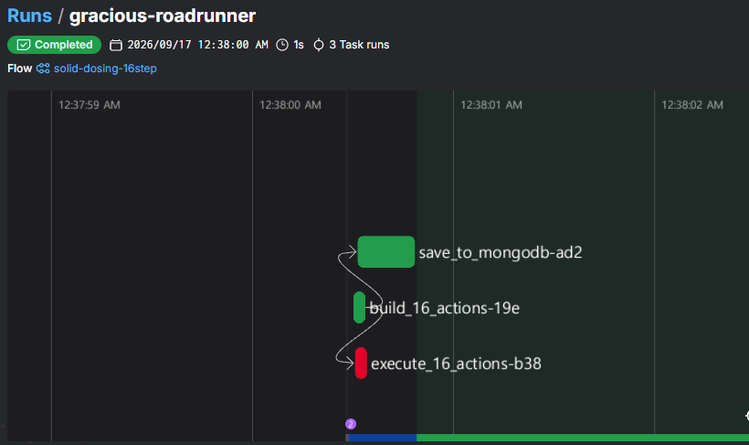
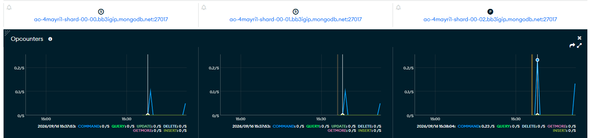

# 16-Step Solid Dosing — 실제 실행 검증

Prefect + MongoDB에 실제로 연동해서 실행한 결과입니다.

## 1) 정상 실행

16개 Action이 build → execute → save 순서로 전부 Completed 상태로
실행된 것을 Prefect UI에서 확인했습니다.

## 2) 안전장치 시연

RETRACT를 강제로 실패시키면, DOOR_CLOSE(#7)가 실행 자체를 거부하며
execute_16_actions Task가 Failed 상태로 기록됩니다.

## 3) MongoDB 저장 확인

task 컬렉션에 실제로 16개 Action이 포함된 Task 문서가 저장된 것을
확인했습니다 (task_id: live_dispense_20260917_003759).
